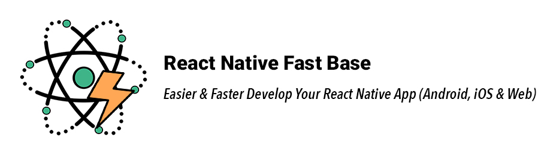

<p align="center">
  
</p>

<p align="center">
  <strong>
    Easier & Faster Develop Your React Native (Expo) App (Android, iOS & Web) 
  </strong>
</p>

<div align="center">
  ⭐️ Highly customizable - Responsive UI - Dark/Light mode support ⭐️
</div>

<br />

<div align="center">
  <a href="/docs/USAGE.md">Documentation</a> · <a href="/example/src/">Examples</a> · <a href="">Demo (Expo)</a>
</div>

<br />

<p align="center">
  <a href="https://opensource.org/licenses/MIT">
    
  </a>
  <a href="https://github.com/Mhp23/react-native-fast-base">
    
  </a>
    <a href="https://twitter.com/HosseinPousti">
      
    </a>
</p>

## Introduction (v2)

React native fast base UI kit will help you to develop your apps faster with optimized and tested components.

## 💫 Features

- <strong>Cross-platform</strong> <i>(Android, iOS, and Web also support for both bare React Native and Expo)</i>
- <strong>Easy to use</strong>
- <strong>Responsive UI</strong>
- <strong>Highly customizable</strong>
- <strong>Highly themeable</strong> - <a href="/docs/USAGE.md#2-🎨-theme-system-design">theme design</a>
- <strong>Written by Typescript, fully typed, and extendable</strong>
- <strong>Dark/Light mode support</strong>
- <strong>Attractive components</strong>

## 📀 Installation

**Yarn**:

```
yarn add @fast-base/native
```

**NPM**:

```
npm install @fast-base/native
```

Also, this package uses `react-native-safe-area-context` if you have already installed it and it was been added to your project dependencies you can skip this step, otherwise:

**Yarn**:

```
yarn add react-native-safe-area-context
```

**NPM**:

```
npm install react-native-safe-area-context
```

## 🚀 Quick Start

```tsx
import * as React from 'react';
import {Container, FastBaseProvider} from '@fast-base/native';

const theme = 'dark';

const MyAwesomeComponent: React.FC = () => {
  return (
    <Container p={10}>
      <Gap>
        <Button opacity type="primary" title="Opacity Button" />
        <Button pressable type="success" title="Pressable Button" />
      </Gap>
    </Container>
  );
};

export default function App() {
  return (
    <FastBaseProvider mode={theme}>
      <MyAwesomeComponent />
    </FastBaseProvider>
  );
}
```

Please see the [example directory](/example/src/) for more examples.

## 📚 Documentation

Please see the [usage documentation](/docs/USAGE.md) to learn how to use the components as basic and advanced usages to have high efficiency.

## ❤️ Support

`react-native-fast-base` as an open-source project is free and always will remain free, if you like this project and think is useful give 🌟 to it.

if you need any help: [business.mhpdev@gmail.com](mailto:business.mhpdev@gmail.com)

## 🤝 Contribution

Please see the [contributing guide](/docs/CONTRIBUTING.md) to learn how to contribute to the repository and the development workflow.

## License

MIT
