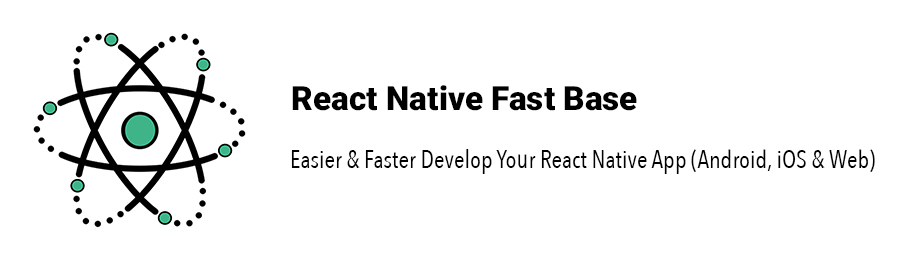
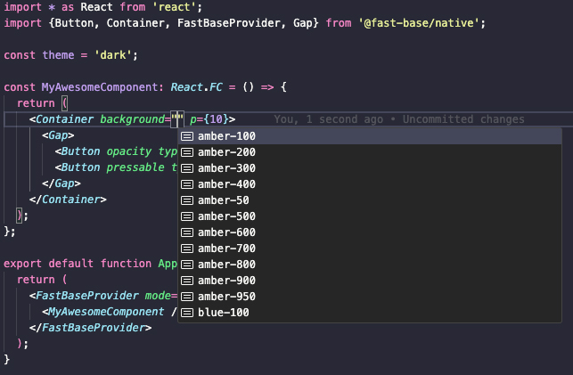
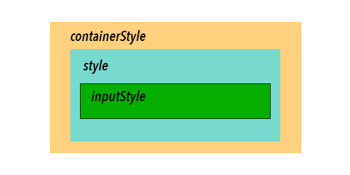

# 📚 Documentation

<p align="center">
  
</p>

<p align="center">
  <strong>
    Easier & Faster Develop Your React Native (Expo) App (Android, iOS & Web) 
  </strong>
</p>

<div align="center">
  ⭐️ Highly customizable - Responsive UI - Dark/Light mode support ⭐️
</div>

<br />

<div align="center">
  <a href="../README.md#📀-installation">Installation</a> · <a href="../example/src/">Examples</a>
</div>

## 1. 📱 Responsive UI

All styles of fast base are responsive and it uses <a href="https://github.com/Mhp23/react-native-full-responsive">react-natvie-full-responsive</a> to achieve responsive UI.

## 2. 🎨 Theme System Design

As mentioned before fast base supports both dark and light mode and you are able to extend your theme for both or one of them. In <a href="#theme">this section</a> you capable of to see how you can extend the theme.

Default theme colors were picked as you can see in the following but as mentioned above you are able to overwrite them:

```tsx
const Theme: ThemeProps = {
  DefaultTheme: {
    colors: {
      text: '#000000',
      flat: '#ECF0F1',
      border: '#DDDDDD',
      surface: '#FFFFFE',
      disabled: '#E0E0DB',
      background: '#F7F9F9',
      secondText: '#626567',
    },
  },
  DarkTheme: {
    colors: {
      text: '#ffffff',
      flat: '#282828',
      border: '#565656',
      surface: '#181818',
      disabled: '#3E3E3E',
      secondText: '#B3B3B3',
      background: '#121212',
    },
  },
};
```

Also, it offers you a collection of colors so you can easily use that like this (inspired `Tailwindcss` colors):

<p align="center">
  
</p>

If you want to see all available colors <a href="../src/core/default/colors.ts">click here</a>

### Theming

At first should Wrap your app in the provider in the root of your application (App.tsx or App.jsx) to access the theme config in other components of all of your app, like:

```tsx
...
export default function App() {
  return (
    <FastBaseProvider>
      {
        //Children
      }
    </FastBaseProvider>
  );
}
```

### Props

### <i>mode</i>

Type: `"light" | "dark"`

Default: Based on your device mode will be set.

Description: To set the current application theme mode.

### <i>enableSystemMode</i>

Type: `boolean`

Default: `true`

At default, if your phone's dark mode is enabled, the theme will change to dark mode. You are able to set this property as false to avoid enabling system mode and the theme will be handled manually.

### <i>theme</i>

Type: `ThemeProps<T>`

Default: `extendTheme()`

You are able to extend your theme or override default theme colors etc:

```tsx
import * as React from 'react';
import {
  Button,
  useTheme,
  Container,
  extendTheme,
  FastBaseProvider,
} from '@fast-base/native';

const theme = 'light';

type MyThemeProps = {
  button: {
    style: object;
  };
  colors: {
    royal: string;
  };
  //...
};

const MyTheme = extendTheme<MyThemeProps>({
  DefaultTheme: {
    button: {
      style: {
        backgroundColor: 'green',
      },
    },
    colors: {
      //override default color
      background: '#f9f9f9',
      //or extend
      royal: 'white',
      ///...
    },
  },
  DarkTheme: {
    button: {
      style: {
        backgroundColor: 'orange',
      },
    },
    colors: {
      //override default color
      background: '#222222',
      //or extend
      royal: 'black',
      ///...
    },
  },
});

const MyComponent: React.FC = () => {
  const {colors, button} = useTheme<MyThemeProps>();

  return (
    <Container background={colors.background} p={10}>
      <Button
        title="Press Me!"
        style={button.style}
        titleColor={colors.royal}
      />
    </Container>
  );
};

export default function App() {
  return (
    <FastBaseProvider theme={MyTheme} mode={theme}>
      <MyComponent />
    </FastBaseProvider>
  );
}
```

As you see in the example you are able to easily access your theme config by `useTheme` hooks (if you are using class components <a href="#withTheme">check out withTheme section</a>)

```tsx
...
const {colors, changeMode, mode, defaultColors} = useTheme<MyThemeProps>();
...
```

**MyThemeProps** is just an example of the custom theme type that you use in `extendTheme`, if you didn't extend the theme the type is not needed anymore.

Also, you can change theme mode manually by `changeMode` method that needs two arguments, the first is required to specify the theme mode and the second argument is the callback function after the theme is changed which is optional (You are able to execute your callback function after the theme mode is changed, such as changing the Android navigation bar color, status bar color, etc.)

```tsx
changeMode('dark' | 'light', newTheme => {
  //do something...
});
//or
changeMode('dark' | 'light', async newTheme => {
  //await do something...
});
```

## 3. 💅 Components

- [Wrapper](#wrapper)<br/>
- [Container](#container)<br/>
- [Text](#text)<br/>
- [Button](#button)
- [Input](#input)
- [Image](#image)
- [Divider](#divider)<br/>
- [Gap](#gap)<br/>
- [ProgressBar](#progressbar)<br/>
- ...Completing

## Wrapper

Flexible and customizable components to implement your layouts as default will not add unnecessary style to the styles and unused styles will be removed. The component was extended from <a href="https://reactnative.dev/docs/view">React Native View</a> component so you are able to use all of the View component properties too.

### <i>mode</i>

Type: `'normal' | 'column' | 'column-reverse' | 'row' | 'row-reverse'`

Default: `normal`

To specify component flex direction

### <i>width</i>

Type: `number`

The responsive width size using passed width percentage.

### <i>height</i>

Type: `number`

The responsive height size using passed height percentage.

### <i>flex</i>

Type: `boolean | number`

You are able to set a boolean or number value for this property, if the value of the flex property is 'true', flex will consider '1', and if you pass a number, a numeric value will be considered for the flex value.

### <i>background</i>

Type: `AllColorsType | string`

To specify the component background color

### <i>ax</i>

Type: `'flex-start' | 'flex-end' | 'center' | 'stretch' | 'baseline'`

To specify the component align items

### <i>ay</i>

Type: `'flex-start' | 'flex-end' | 'center' | 'space-between' | 'space-around' | 'space-evenly'`

To specify the component justify content

### <i>self</i>

Type: `'auto' | 'flex-start' | 'flex-end' | 'center' | 'stretch' | 'baseline'`

To specify the component align self

### <i>padding (px, py, pt, pb,...)</i>

Type: `number`

Default: `0`

To add padding to the component, the properties are used as an abbreviation, like (padding: p, paddingTop: pt,....)

### <i>margin (mx, my, mt, mb,...)</i>

Type: `number`

Default: `0`

To add margin to the component, the properties are used as an abbreviation, like (margin: m, marginTop: mt,....)

Would you like to learn more about `Wrapper` usage, <a href="/example/src/WrapperExample/index.tsx">see the example</a>
<br />

## Container

The Container component was implemented by `SafeAreaView` in `react-native-safe-area-context` to create a full-screen layout to put other components on a screen inside it, so you are able to use all properties of the component. In additional:

### <i>background</i>

Type: `AllColorsType | string`

To specify the component background color

### <i>padding (px, py, pt, pb,...)</i>

Type: `number`

Default: `0`

To add padding to the component, the properties are used as an abbreviation, like (padding: p, paddingTop: pt,....)

### <i>margin (mx, my, mt, mb,...)</i>

Type: `number`

Default: `0`

To add margin to the component, the properties are used as an abbreviation, like (margin: m, marginTop: mt,....)

Would you like to learn more about `Container` usage, <a href="/example/src/ContainerExample/index.tsx">see the example</a>
<br />

## Text

Text component extended from <a href="https://reactnative.dev/docs/text">React Native Text</a> so you capable of to use all the component props in the Text component, in additional:

### <i>size</i>

Type: `number | xs | sm | md | lg | xl | 2xl | 3xl | 4xl | 5xl | 6xl | 7xl | 8xl | 9xl | 10xl`

Default: `md`

To specify the component font size

### <i>color</i>

Type: `AllColorsType | string`

Default: `colors.text`

Text component extended from React Native Text, you are capable of using all the component props in the Text component. In additional:

### <i>ax</i>

Type: `'auto' | 'left' | 'right' | 'center' | 'justify'`

To specify the component text align

### <i>height</i>

Type: `number`

To specify the component line height

### <i>weight</i>

Type: `'normal' | 'bold' | '100' | '200' | '300' | '400' | '500' | '600' | '700' | '800' | '900'`

To specify the component font weight

### <i>font</i>

Type: `T | string`

To specify the component font family, you are capable of using your type as generic in the text component. In typescript, the Text component allows you to use custom fonts that you added to your project, only need to wrap your type inside it like the below example you can create a custom component on top of the text component and easier use font property:

```tsx
...
  <Text<'MyFont1' | 'MyFont2'> {...props}>
    Awesome Text!
  </Text>
...
```

Would you like to learn more about `Text` usage, <a href="/example/src/TextGapExample/index.tsx">see the example</a>
<br />

## Button

The Button component was extended from <a href="https://reactnative.dev/docs/pressable">React Native Pressable</a> component so you are able to use all of the component properties and also it helps you create attractive customizable opacity and pressable buttons with title or custom children.

### <i>children</i>

Type: `string | ReactNode`

### <i>pressable</i>

Type: `boolean`

Default: `false`

To specify does the button component is pressable or not

### <i>opacity</i>

Type: `boolean | number`

Default: `false`

To specify does the button component is an opacity or not, if the property is `true`, the default opacity value will be `0.5`.

### <i>type</i>

Type: `'primary' | 'secondary' | 'success' | 'warning' | 'error'`

To specify the component type. As default, if the button has title or string children the property will be `primary`.

### <i>mode</i>

Type: `'solid' | 'outline' | 'transparent'`

To specify the button style mode.

### <i>size</i>

Type: `xs | sm | md | lg | xl`

To specify the button size. if the button has title or string children the property will be `md`.

### <i>loading</i>

Type: `boolean`

To enable activity indicator.

### <i>loadingColor</i>

Type: `AllColorsType | string`

### <i>loadingProps</i>

Type: `ActivityIndicatorProps`

All available properties in the <a href="https://reactnative.dev/docs/activityindicator">ActivityIndicator</a> component

### <i>title</i>

Type: `string`

### <i>color</i>

Type: `AllColorsType | string`

To specify the button color

### <i>titleStyle</i>

Type: `TextStyle`

### <i>titleColor</i>

Type: `AllColorsType | string`

To specify the button title color

### <i>titleProps</i>

Type: `TextProps`

All available properties in the <a href="https://reactnative.dev/docs/text">Text</a> component

### <i>radius</i>

Type: `number | xs | sm | md | lg | xl`

Default: `xs`

To specify the component border radius

### <i>shadow</i>

Type: `boolean | 'low' | 'medium' | 'high'`

To specify the component shadow, Please consider shadow only works on the `solid` mode. Also if the shadow property is `true` the low shadow will assign.

### <i>disabledButtonColor</i>

Type: `AllColorsType | string`

### <i>disabledTitleColor</i>

Type: `AllColorsType | string`

### <i>disabledTitleStyle</i>

Type: `TextStyle`

### <i>borderColor</i>

Type: `AllColorsType | string`

To specify the button border color

### <i>pressableConfig</i>

Type: `UseAnimationConfig`

To specify the button pressable `pressIn` and `pressOut` custom animation config.

### <i>opacityConfig</i>

Type: `Pick<UseAnimationConfig, 'pressIn'>`

To specify the button opacity `pressIn` custom animation config.

Would you like to learn more about `Button` usage, <a href="/example/src/ButtonExample/index.tsx">see the example</a>
<br />

## Input

Another component that is commonly used in applications is text input. The Input component is designed to create customizable text input. The Input component has two separate sub-components: `Outline` and `Underline`. Both of these sub-components have almost the same properties, which we will become familiar with.

<p align="center">
  
</p>

### Common Props

### <i>disabled</i>

Type: `boolean`

Default: `false`

To disable text input completely and change style to disabled mode

### <i>readonly</i>

Type: `boolean`

Default: `false`

With the property, text input is no longer editable and is just readable

### <i>invalid</i>

Type: `boolean`

Default: `false`

With the property, the text input style will change to invalid mode

### <i>invalid</i>

Type: `boolean`

Default: `false`

To specify that the component content is a password

### <i>size</i>

Type: `xs | sm | md | lg | xl`

Default: `md`

To specify the component size

### <i>size</i>

Type: `AllColorsType | string`

Default: `md`

To specify the component background color

### <i>useNativeDriver</i>

Type: `boolean`

Default: `true`

To specify the component animations use native driver or JS bridge

### <i>inputStyle</i>

Type: `TextStyle`

To specify custom styles for the text input

### <i>label</i>

Type: `string | ReactNode`

### <i>labelStyle</i>

Type: `TextStyle`

### <i>invalidLabel</i>

Type: `string | ReactNode`

Only works when the invalid property is enabled

### <i>invalidLabelStyle</i>

Type: `TextStyle`

### <i>hintLabel</i>

Type: `string | ReactNode`

To specify in particular hints to the user such as about what the text input content should be

### <i>hintLabelStyle</i>

Type: `TextStyle`

### <i>leftElement</i>

Type: `ReactNode`

To specify the custom left element on the text input

### <i>rightElement</i>

Type: `ReactNode`

To specify the custom right element on the text input

### <i>leftParentProps</i>

Type: `WrapperProps`

To specify the custom right element on the text input

### <i>rightParentProps</i>

Type: `WrapperProps`

To specify the custom right element on the text input

### <i>invalidStyle</i>

Type: `ViewStyle`

Only works when the invalid property is enabled and the text input is unfocused

### <i>borderWidth</i>

Type: `number`

Default: `1.5`

### <i>unFocusedBorderColor</i>

Type: `AllColorsType | string`

Default: `colors.border`

### <i>focusedBorderColor</i>

Type: `AllColorsType | string`

Default: `primary`

### <i>containerStyle</i>

Type: `ViewStyle`

Parent container of the text input, recommend using for custom styles like padding or margin.

### Only Outline Props

### <i>radius</i>

Type: `number | xs | sm | md | lg | xl | full`

Default: `xs`

To specify the component border radius

### Only Underline Props

### <i>animatable</i>

Type: `boolean`

Default: `true`

In order to show/hide the border animatedly when focused and on blurred.

### <i>focusDuration</i>

Type: `number`

Default: `250`ms

The border scale animation duration when input focused, only works when the animatable property is enabled.

### <i>blurDuration</i>

Type: `number`

Default: `200`ms

The border scale animation duration when input is blurred, only works when the animatable property is enabled.

### Methods

All availibe methods in <a href="https://reactnative.dev/docs/textinput#methods">React Native TextInput</a> when you define `ref`, in additional:

### <i>.shake(duration: number)</i>

Default: `600`ms

To shake animate text input (e.g. when invalid data in input is submitted)

### <i>.bounce(duration: number)</i>

Default: `600`ms

To bounce animate text input (e.g. when invalid data in input is submitted)

Would you like to learn more about `Input` usage, <a href="/example/src/InputExample/index.tsx">see the example</a>
<br />

## Image

One of the other components used in almost all applications is Image, This component is extended from <a href="https://reactnative.dev/docs/image">React Native Image</a> component so you are able to use all of the component properties. In additional:

### <i>size</i>

Type: `xs | sm | md | lg | xl | 2xl`

Default: `md`

Should use only one of the size property or width and height properties

### <i>width</i>

Type: `number`

With using width or height, the size property will useless

### <i>height</i>

Type: `number`

With using width or height, the size property will useless

### <i>radius</i>

Type: `number | xs | sm | md | lg | xl | 2xl | full`

To specify the component border radius

### <i>noCache</i>

Type: `number | xs | sm | md | lg | xl | 2xl | full`

To disable default React Native image caching, it works only when you use URI to specify the image source

### <i>aspectRatio</i>

Type: `string | number | 16/9 | 4/3 | 1/1 | 2/3 | 9/16 | 3/2 | 5/3`

### <i>skeletonLoading</i>

Type: `boolean`

Default: `false`

To specify showing skeletion loading when image is loading

### <i>loadingColor</i>

Type: `AllColorsType | string`

Would you like to learn more about `Image` usage, <a href="/example/src/ImageExample/index.tsx">see the example</a>
<br />

## Divider

This component will help you make `vertical` or `horizontal` space between your elements as `padding` or `border`.

### <i>direction</i>

Type: `vertical | horizontal`

Default: `vertical`

### <i>mode</i>

Type: `padding | border`

Default: `border`

### <i>width</i>

Type: `padding | border`

Default: `border`

The border width of the divider, in the padding, will be considered as space.

### <i>color</i>

Type: `AllColorsType | string`

Default: `colors.border`

To specify border color in the border mode

### <i>style</i>

Type: `ViewStyle`
<br />

## Gap

This component will help you to make `vertical` or `horizontal` space between all elements put on it as children

### <i>mode</i>

Type: `H | V`

Default: `V`

The direction of applying space gap, "H" means horizontal, and "V" means vertical

### <i>space</i>

Type: `number | xs | sm | md | lg | xl`

Default: `xs`

The space value between each items

### <i>reversed</i>

Type: `boolean`

Default: `false`

To reverse children's items priority

### <i>behavior</i>

Type: `style | divider`

Default: `divider`

The behavior could be style or element:

- Style: will add margin style to your element based on the current mode (Please consider style only add to element if the children elements could accept style, such as View, Text, Image, etc.)
- Divider: will add a divider component between your children's elements based on the current mode

### <i>dividerProps</i>

Type: `DividerProps`

Only works when the behavior is "divider"

Would you like to learn more about `Gap` usage, <a href="/example/src/TextGapExample/index.tsx">see the example</a>
<br />

## ProgressBar

This component will help when you want to show a progress bar such as download/upload or loading indicator with progress or whatever you want.

### <i>value</i>

Type: `number`

The progress bar value, should be between 0 to 100

### <i>width</i>

Type: `number`

### <i>height</i>

Type: `number | xs | sm | md | lg | xl`

Default: `md`

### <i>background</i>

Type: `AllColorsType | string`

Default: `colors.flat`

### <i>progressColor</i>

Type: `AllColorsType | string`

Default: `primary`

### <i>style</i>

Type: `ViewStyle`

To specify the component container style

### <i>useNativeDriver</i>

Type: `boolean`

Default: `true`

To specify the component animations use native driver or JS bridge

### <i>isRTL</i>

Type: `boolean`

To fill progress bar right to left

Would you like to learn more about `ProgressBar` usage, <a href="/example/src/ProgressExample/index.tsx">see the example</a>
<br />

## 4. 🏭 Methods

### withTheme

As you see above you can easily access the theme config like color etc. by `useTheme` hooks, but if you are using a class-based component for implementation, only need to wrap your component in `withTheme` HOC and will access the config as **props** in the component.

```tsx
...
class MyComponent extends React.Component {
  //component content
}

export default withTheme(MyComponent);
...
```

### mergeRefs

Sometimes you need to use multiple `ref` for a single component since you probably know React doesn't support multiple ref, you can merge them and then use it

```tsx
...
const allRefs = mergeRefs([ref1, ref2, ...])
...
```

## 5. 🚶‍♂️ V1 -> V2

In V2, some unnecessary components were removed. Additionally, the Icon component from version V1 was removed because it was being used from react-native-vector-icons, which does not support Expo by default. One of the most important goals of Fast Base is to be completely compatible with both bare React Native and Expo.

Icons have been developed as an independent project. If you need modern and customizable icons, <a target="blank" href="https://github.com/Mhp23/fast-base-icons">please see here</a>.
